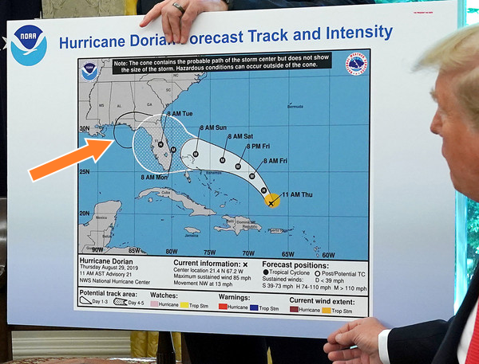
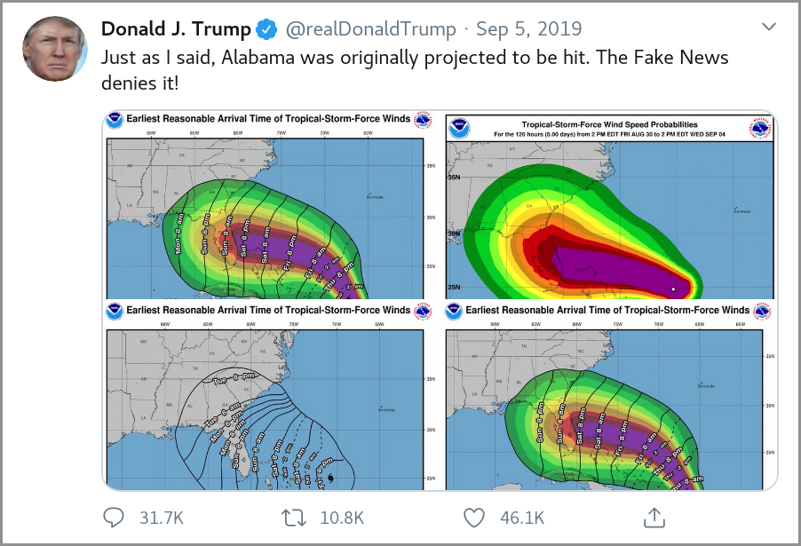
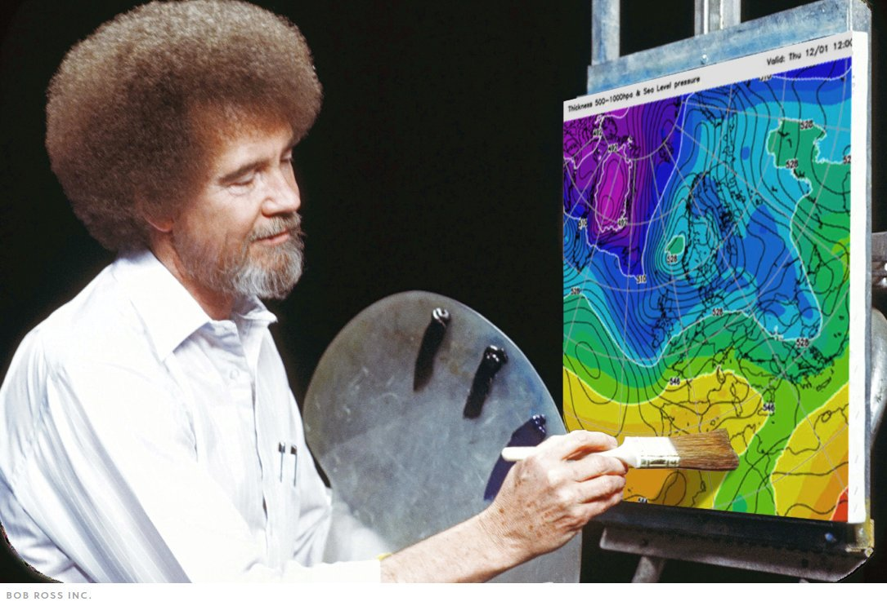
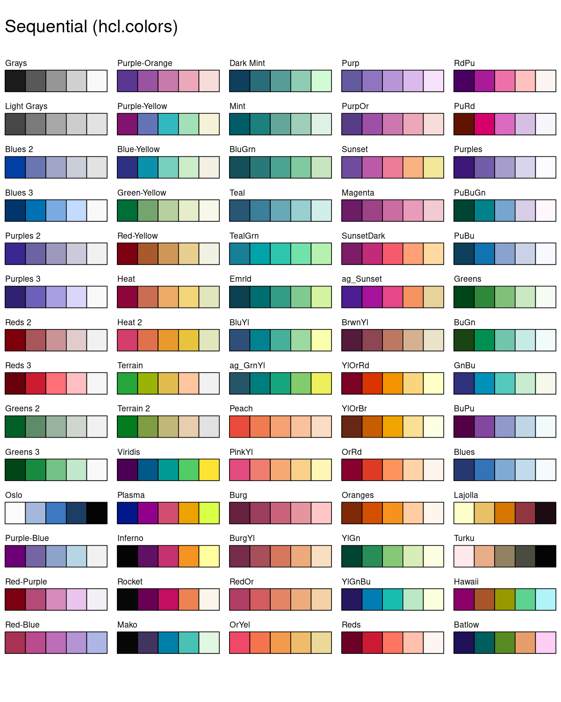
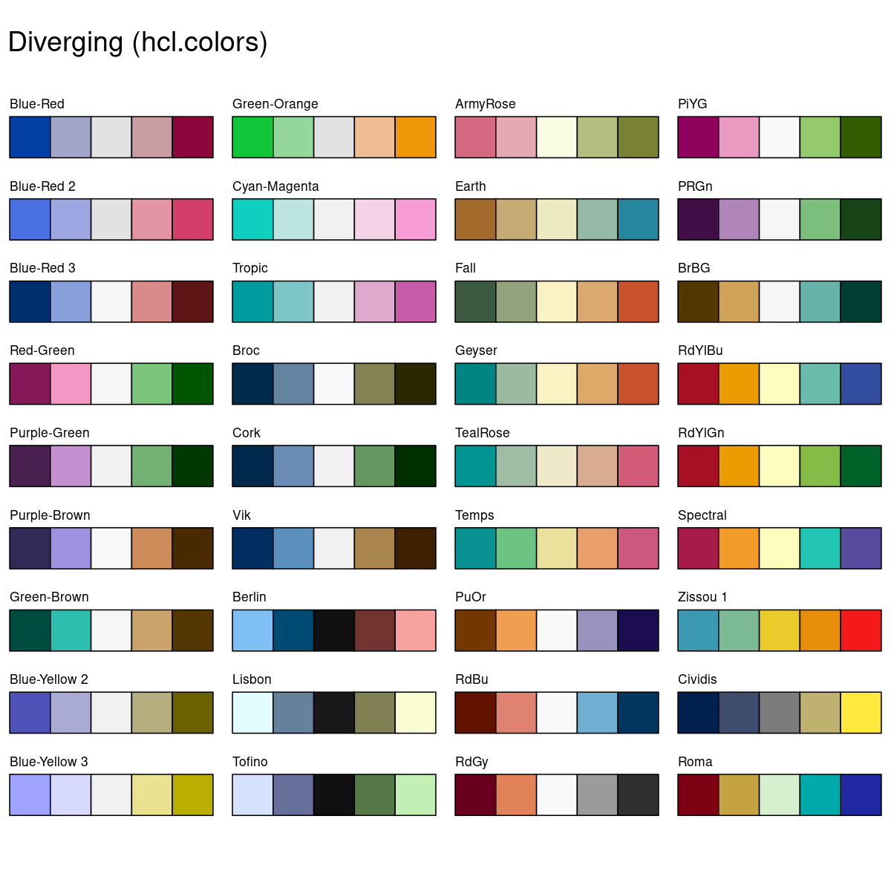
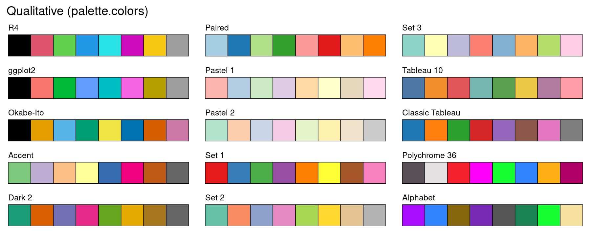
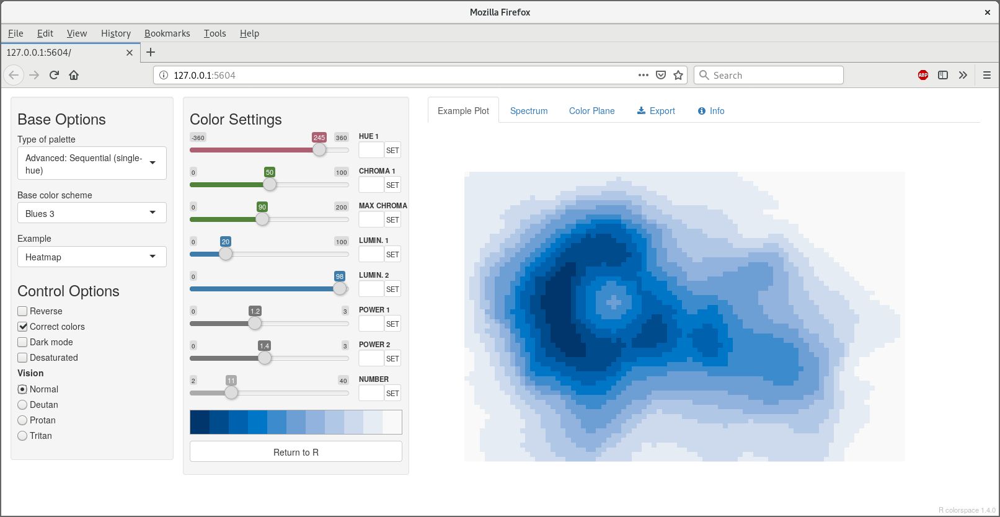
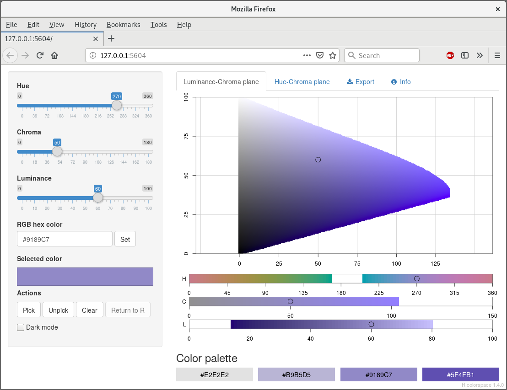
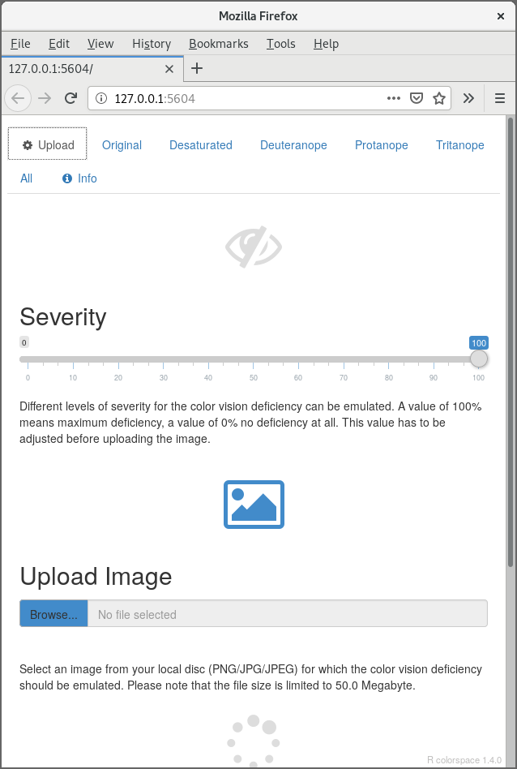
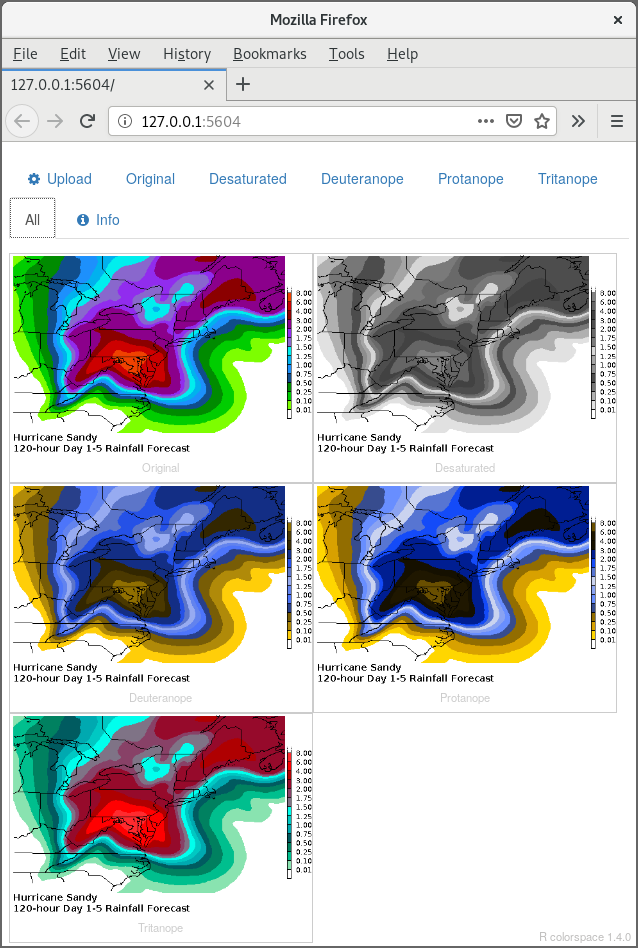

```{r setup}
#| include: false
library("colorspace")
library("tinyplot")
library("stars")
library("sf")
library("ggplot2")
library("rnaturalearth")

knitr::opts_chunk$set(
  engine = "R",
  echo = FALSE,
  fig.height = 6,
  fig.width = 5.4,
  out.width = "100%"
)
set.seed(403)
```


## Motivation

**Colors in data visualization:**

- Ubiquitous.
- Not always easy to choose.
- But also perceived as fun.

**Potential problems:**

- Power of color often overestimated.
- Color vision deficiencies ($\sim 8$% of male and $\sim 0.5$% of female viewers).
- Other physical or technical limitations.


## Motivation

:::: {.columns}

::: {.column width="0%"}
:::

::: {.column width="50%"}
**Challenge:**

- Color memory game.
- <https://dialed.gg/?c=QPFVHK>
:::

::: {.column width="50%"}
```{r dialed-qrcode}
#| fig-height: 6
#| fig-width: 6
#| out-width: 75%
plot(qrcode::qr_code("https://dialed.gg/?c=QPFVHK"))
```
:::

::::


## Motivation

**Luckily:** Matching individual colors is not so important.

**Instead:** Palette of colors that cooperate with each other.

. . .

\bigskip

```{r palettes-principles}
#| fig-height: 1.6
#| fig-width: 12
swatchplot(
  "Qualitative (Set 2)"     = rbind("Color" = qualitative_hcl(5, "Set 2"),     "Desaturated" = desaturate(qualitative_hcl(5, "Set 2"))),
  "Sequential (Blues 3)"    = rbind("Color" = sequential_hcl(7, "Blues 3"),    "Desaturated" = desaturate(sequential_hcl(7, "Blues 3"))),
  "Diverging (Green-Brown)" = rbind("Color" = diverging_hcl(7, "Green-Brown"), "Desaturated" = desaturate(diverging_hcl(7, "Green-Brown"))),
  nrow = 3, line = 7)
```

\medskip

**Qualitative:** For categorical information with no particular ordering.  
Luminance differences should be limited.

**Sequential:** For ordered/numeric information from high to low (or vice versa).

**Diverging:** For ordered/numeric information diverging from a central neutral value to two extremes.


## Illustration: Hurricane Dorian forecast

:::: {.columns}

::: {.column width="2%"}
:::

::: {.column width="48%"}
{width=88%}

**Source:** White House (2019-09-04)
:::

::: {.column width="50%"}
{width=95%}

**Source:** U.S. president (2019-09-05)
:::

::: {.column width="0%"}
:::

::::


## Illustration: Hurricane Dorian forecast

:::: {.columns}

::: {.column width="0%"}
:::

::: {.column width="58%"}

\only<1>{\includegraphics[width=0.98\textwidth]{../EGU2020/images/dorian-rainbow.png}}
\only<2-3>{\includegraphics[width=0.98\textwidth]{../EGU2020/images/dorian-rainbow-arrow.png}}
\only<4>{\includegraphics[width=0.98\textwidth]{../EGU2020/images/dorian-rainbow-deutan.png}}
\only<5>{\includegraphics[width=0.98\textwidth]{../EGU2020/images/dorian-rainbow-gray.png}}
\only<6>{\includegraphics[width=0.98\textwidth]{../EGU2020/images/dorian-hclrainbow.png}}
\only<7>{\includegraphics[width=0.98\textwidth]{../EGU2020/images/dorian-hclrainbow-gray.png}}
\only<8>{\includegraphics[width=0.98\textwidth]{../EGU2020/images/dorian-hclrainbow-deutan.png}}

:::

::: {.column width="42%"}

**Risk map:** Probability of wind speeds $>$ 39 mph (63 km h$^{-1}$), 2019-08-30--2019-09-04.

\medskip

**Source:** National Oceanic and Atmospheric Administration.

\medskip

\visible<3->{\textbf{Problems:} Flashy.}
\visible<4->{Color vision deficiency.}
\visible<5->{Grayscale.}

\medskip

\visible<6->{\textbf{Alternative:} HCL-based sequential palette.}
:::

::::


## Goals

**Need strategies for:**

- Construction of palettes with better perceptual properties.
- Assessment of color palettes.
- Manipulation of colors.

. . .

\medskip

:::: {.columns}

::: {.column width="0%"}
:::

::: {.column width="48%"}
{width=100%}
:::

::: {.column width="48%"}
Because Bob Ross would not approve of this!
:::

::::


## HCL vs. RGB

:::: {.columns}

::: {.column width="0%"}
:::

::: {.column width="50%"}
**HCL:** Polar coordinates in CIELUV. Captures perceptual dimensions of the human visual system very well.

\bigskip

```{r hcl-properties}
#| fig-width: 4
#| fig-height: 2.2
swatchplot(
  "Hue\n(Type of color)"       = sequential_hcl(5, h = c(0, 300), c = c(60, 60), l = 65),
  "Chroma\n(Colorfulness)"    = sequential_hcl(5, h = 0, c = c(100, 0), l = 65, rev = TRUE, power = 1),
  "Luminance\n(Brightness)" = sequential_hcl(5, h = 260, c = c(25, 25), l = c(25, 90), rev = TRUE, power = 1),
  nrow = 3, line = 5.2, off = 0
)
```
:::

::: {.column width="50%"}
**RGB:** Motivated by how computers or TVs used to generate and still represent color.

\bigskip

```{r rgb-properties}
#| fig-width: 3.6
#| fig-height: 2.2
#| out-width: 90%
swatchplot(
  "Red"       = rgb(0:4/4, 0, 0),
  "Green"     = rgb(0, 0:4/4, 0),
  "Blue"      = rgb(0, 0, 0:4/4),
  nrow = 3, off = 0
)
```

:::

::::


## HCL vs. RGB

:::: {.columns}

::: {.column width="0%"}
:::

::: {.column width="50%"}
```{r hcl-rainbow}
#| fig-height: 6
#| fig-width: 5.4
#| out-width: 95%
specplot(rainbow_hcl(99, c = 60, l = 75), rgb = TRUE)
```
:::

. . .

::: {.column width="50%"}
```{r rgb-rainbow}
#| fig-height: 6
#| fig-width: 5.4
#| out-width: 95%
specplot(rainbow(95), rgb = TRUE)
```
:::

::::


## Color palettes

\only<1>{
\textbf{Sequential:} Luminance contrast is crucial (dark to light or vice versa).
}
\only<2>{
\textbf{Blues 2:} Single hue. Decreasing chroma with increasing luminance.
}
\only<3>{
\textbf{Blues 3:} Single hue. Triangular chroma to achieve higher luminance contrast.
}
\only<4>{
\textbf{Blues:} Multi hue. Triangular chroma. High luminance contrast.
}

:::: {.columns}

::: {.column width="0%"}
:::

::: {.column width="50%"}
```{r blues}
#| fig-height: 2.2
#| fig-width: 4
swatchplot(
  "Blues 2" = sequential_hcl(7, "Blues 2"),
  "Blues 3" = sequential_hcl(7, "Blues 3"),
  "Blues"   = sequential_hcl(7, "Blues")
)
```
:::

::: {.column width="50%"}
```{r blues-spectrum}
#| fig-width: 5.2
#| fig-height: 5.2
#| fig-show: hide
specplot(sequential_hcl(7, "Blues 2"))
specplot(sequential_hcl(7, "Blues 3"))
specplot(sequential_hcl(7, "Blues"))
```

\only<2>{\includegraphics[width=0.95\textwidth]{slides_files/figure-beamer/blues-spectrum-1.pdf}}
\only<3>{\includegraphics[width=0.95\textwidth]{slides_files/figure-beamer/blues-spectrum-2.pdf}}
\only<4>{\includegraphics[width=0.95\textwidth]{slides_files/figure-beamer/blues-spectrum-3.pdf}}
:::

::::


## Color palettes

:::: {.columns}

::: {.column width="0%"}
:::

::: {.column width="50%"}
```{r dorian-spectrum}
#| fig-height: 6
#| fig-width: 5.4
#| out-width: 95%
specplot(
  c("#008a02", "#00cb00", "#82fd00", "#f5f900", "#f7d600", "#d58600", "#fb7502", "#a80003", "#740001", "#8c0084"), ## actually: "#8a0087"
  main = "NOAA original"
)
```
:::

. . .

::: {.column width="50%"}
```{r dorian-hcl-spectrum}
#| fig-height: 6
#| fig-width: 5.4
#| out-width: 95%
specplot(
  sequential_hcl(10, palette = "Purple-Yellow", rev = TRUE, c1 = 70, cmax = 100, l2 = 80, h2 = 500),
  main = "HCL-based alternative")
```
:::

::::


## Color palettes

**Diverging:** Combine two sequential palettes with balanced chroma/luminance.

:::: {.columns}

::: {.column width="0%"}
:::

::: {.column width="50%"}
```{r red-blue-spectrum}
#| fig-height: 5.6
#| fig-width: 5.4
#| out-width: 95%
specplot(diverging_hcl(9, "Blue-Red", h2 = 5, rev = TRUE))
```
:::

. . .

::: {.column width="50%"}
```{r green-brown-spectrum}
#| fig-height: 5.6
#| fig-width: 5.4
#| out-width: 95%
specplot(diverging_hcl(9, "Green-Brown"))
```
:::

::::


## Color palettes

\vspace*{-0.35cm}

:::: {.columns}

::: {.column width="0%"}
:::

::: {.column width="50%"}
{width=93%}
:::

::: {.column width="50%"}
{width=93%}
:::

::::


## Illustration: World Bank climate projections

```{r wb-spatial-temperature}
#| fig-width: 10
#| fig-height: 7.5
#| fig-show: hide
ne <- ne_countries(returnclass = "sf")
tas <- read_stars("data/anomaly-tas-annual-mean_cmip6-x0.25_ensemble-all-ssp245_climatology_median_2040-2059.nc")
lim <- range(as.data.frame(tas)[, 4])
wb_temp <- ggplot() + geom_stars(data = tas) + theme_minimal() +
    geom_sf(data = ne, fill = NA, lwd = 0.6) +
    labs(title = "Anomaly of average mean temperature 2040-2059") +
    labs(subtitle = "Intermediate scenario (SSP2, 4.5°C), reference period 1995-2014") +
    theme_minimal() +
    theme(axis.title.x = element_blank(), axis.title.y = element_blank())
wb_temp + scale_fill_continuous_sequential("ag_Sunset", p1 = 0.6, limits = lim,              name = bquote(degree*C))
wb_temp + scale_fill_continuous_sequential("Reds 3",    p1 = 0.6, limits = lim * c(1, 0.85), name = bquote(degree*C))
```

\only<1>{\includegraphics[width=0.98\textwidth]{slides_files/figure-beamer/wb-spatial-temperature-1.pdf}}
\only<2>{\includegraphics[width=0.98\textwidth]{slides_files/figure-beamer/wb-spatial-temperature-2.pdf}}


## Illustration: World Bank climate projections

```{r wb-spatial-precipitation}
#| fig-width: 10
#| fig-height: 7.5
#| fig-show: hide
prp <- read_stars("data/anomaly-prpercnt-annual-mean_cmip6-x0.25_ensemble-all-ssp245_climatology_median_2040-2059.nc")
lim <- c(-1, 1) * max(abs(as.data.frame(prp)[, 4]))
wb_prp <- ggplot() + geom_stars(data = prp) + theme_minimal() +
    geom_sf(data = ne, fill = NA, lwd = 0.6) +
    labs(title = "Anomaly of relative precipitation change, 2040-2059") +
    labs(subtitle = "Intermediate scenario (SSP2, 4.5°C), reference period 1995-2014") +
    theme_minimal() +
    theme(axis.title.x = element_blank(), axis.title.y = element_blank())
wb_prp + scale_fill_continuous_diverging("Blue-Red",    rev = TRUE, h2 = 5, p1 = 0.8, limits = lim, name = bquote("%"))
wb_prp + scale_fill_continuous_diverging("Green-Brown", rev = TRUE, cmax = 60,        limits = lim, name = bquote("%"))
```

\only<1>{\includegraphics[width=0.98\textwidth]{slides_files/figure-beamer/wb-spatial-precipitation-1.pdf}}
\only<2>{\includegraphics[width=0.98\textwidth]{slides_files/figure-beamer/wb-spatial-precipitation-2.pdf}}


## Illustration: IPCC climate projection

```{r ipcc-lineplot}
#| fig-width: 8
#| fig-height: 5
#| fig-show: hide
d <- readRDS("data/IPCC_AR6_global_surface_temp_change.rds")
title <- "Global surface temperature change relative to 1850-1900"

cols <- c("#000000", "#00a9d1", "#29416e", "#e58c35", "#dd4048", "#942324")
tinyplot(Mean ~ Year | Scenario, data = d, type = "l", lwd = 3, theme = "clean2",
  main = title, xlab = NA, ylab = "Temperature change [°C]",
  col = cols)

tinyplot(Mean ~ Year | Scenario, data = d, type = "l", lwd = 3, theme = "clean2",
  main = title, xlab = NA, ylab = "Temperature change [°C]",
  col = cols, legend = FALSE, xlim = c(1950, 2120))
tinyplot_add(data = subset(d, Year == max(Year)), type = "text",
  labels = paste0(tail(unique(d$Scenario), -1), "°C"), pos = 4, xpd = TRUE)

cols <- palette.colors()[c(1, 6, 3, 4, 2, 7)]
tinyplot(Mean ~ Year | Scenario, data = d, type = "l", lwd = 3, theme = "clean2",
  main = title, xlab = NA, ylab = "Temperature change [°C]",
  col = cols, legend = FALSE, xlim = c(1950, 2120))
tinyplot_add(data = subset(d, Year == max(Year)), type = "text",
  labels = paste0(tail(unique(d$Scenario), -1), "°C"), pos = 4, xpd = TRUE)

cols <- rev(c(diverging_hcl(5, "Blue-Red", rev = TRUE, l2 = 70), "#000000"))
tinyplot(Mean ~ Year | Scenario, data = d, type = "l", lwd = 3, theme = "clean2",
  main = title, xlab = NA, ylab = "Temperature change [°C]",
  col = cols, legend = FALSE, xlim = c(1950, 2120))
tinyplot_add(data = subset(d, Year == max(Year)), type = "text",
  labels = paste0(tail(unique(d$Scenario), -1), "°C"), pos = 4, xpd = TRUE)

cols <- rev(c(sequential_hcl(7, "ag_Sunset")[3:7], "#000000"))
tinyplot(Mean ~ Year | Scenario, data = d, type = "l", lwd = 3, theme = "clean2",
  main = title, xlab = NA, ylab = "Temperature change [°C]",
  col = cols, legend = FALSE, xlim = c(1950, 2120))
tinyplot_add(data = subset(d, Year == max(Year)), type = "text",
  labels = paste0(tail(unique(d$Scenario), -1), "°C"), pos = 4, xpd = TRUE)
```

\only<1>{\includegraphics[width=0.9\textwidth]{slides_files/figure-beamer/ipcc-lineplot-1.pdf}}
\only<2>{\includegraphics[width=0.9\textwidth]{slides_files/figure-beamer/ipcc-lineplot-2.pdf}}
\only<3>{\includegraphics[width=0.9\textwidth]{slides_files/figure-beamer/ipcc-lineplot-3.pdf}}
\only<4>{\includegraphics[width=0.9\textwidth]{slides_files/figure-beamer/ipcc-lineplot-4.pdf}}
\only<5>{\includegraphics[width=0.9\textwidth]{slides_files/figure-beamer/ipcc-lineplot-5.pdf}}


## Color palettes

{width=100%}


## Tools

**Software:** `colorspace`.

- Python: [`https://retostauffer.github.io/python-colorspace/`](https://retostauffer.github.io/python-colorspace/)

- R: [`https://colorspace.R-Forge.R-project.org/`](https://colorspace.R-Forge.R-project.org/)

\bigskip

**Apps:** Facilitate interactive exploration.

- Online: [`https://hclwizard.org/`](https://hclwizard.org/)
- Palette constructor.
- Color picker.
- Color vision deficiency emulator.


## Tools

{width=98%}


## Tools

{width=66%}


## Tools

{width=34%} {width=34%}


## Recommendations

**Colors and palettes:**

- Check whether color is appropriate for coding your information.
- Use appropriate type of palette.
- Don't reinvent the wheel, start out from well-established palettes.  
- For areas use light colors (higher luminance, lower chroma).
- For points/lines darker colors are needed (lower luminance, higher chroma).
- Check robustness of palette.

---

## References

\small

Stauffer R, Zeileis A (2024).
  "colorspace: A Python Toolbox for Manipulating and Assessing Colors and Palettes."
  _Journal of Open Source Software_, **9**(102), 7120.
  [`doi:10.21105/joss.07120`](https://doi.org/10.21105/joss.07120)

\medskip

Zeileis A, Fisher JC, Hornik K, Ihaka R, McWhite CD, Murrell P, Stauffer R, Wilke CO (2020).
  "colorspace: A Toolbox for Manipulating and Assessing Colors and Palettes."
  _Journal of Statistical Software_, **96**(1), 1--49.
  [`doi:10.18637/jss.v096.i01`](https://doi.org/10.18637/jss.v096.i01)

\medskip

Stauffer R, Mayr GJ, Dabernig M, Zeileis A (2015).
  "Somewhere over the Rainbow: How to Make Effective Use of Colors in Meteorological Visualizations."
  _Bulletin of the American Meteorological Society_, **96**(2), 203--216.
  [`doi:10.1175/BAMS-D-13-00155.1`](https://doi.org/10.1175/BAMS-D-13-00155.1)

\bigskip

**Credits:** Warming stripes 1777--2024 for Innsbruck, Austria, by
[Ed Hawkins, University of Reading](https://showyourstripes.info/s/europe/austria/innsbruck),
under [{width=6mm} CC BY 4.0 license](https://creativecommons.org/licenses/by/4.0/).

Ed Hawkins, University of Reading: Warming stripes 1777--2024 for Innsbruck, Austria
https://creativecommons.org/licenses/by/4.0/


## References

IPCC, 2024. IPCC AR6 Synthesis Report SPM.4 (a) and LR Figure 3.3 (a) (Linear graph):
    Global surface temperature change relative to 1850-1900. Palisades, New
    York: NASA Socioeconomic Data and Applications Center (SEDAC).
    [`doi:10.7927/606k-d497`](https://doi.org/10.7927/606k-d497). Accessed April 6, 2026.

Spatial projection data from the Climate Change Knowledge Project by
    the World Bank under [{width=6mm} CC BY 4.0 license](https://creativecommons.org/licenses/by/4.0/),
    <https://climateknowledgeportal.worldbank.org/>.
