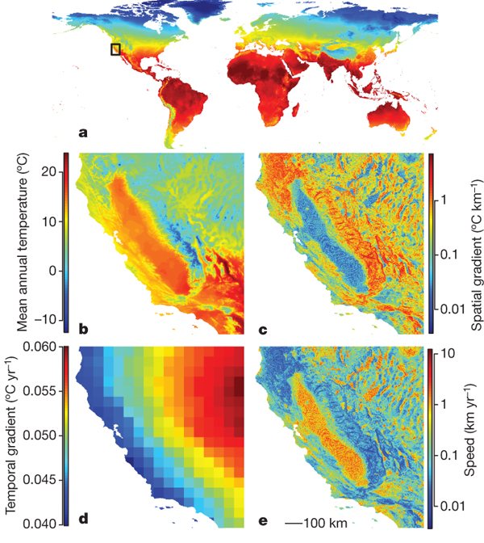
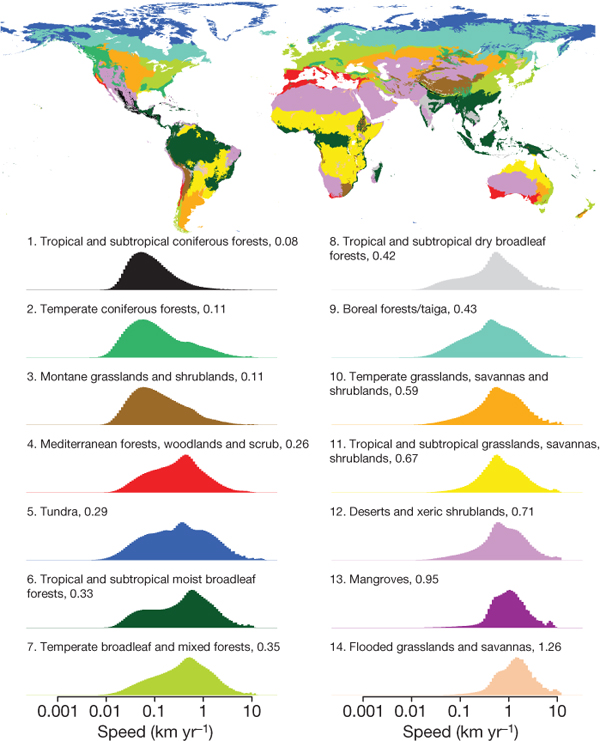
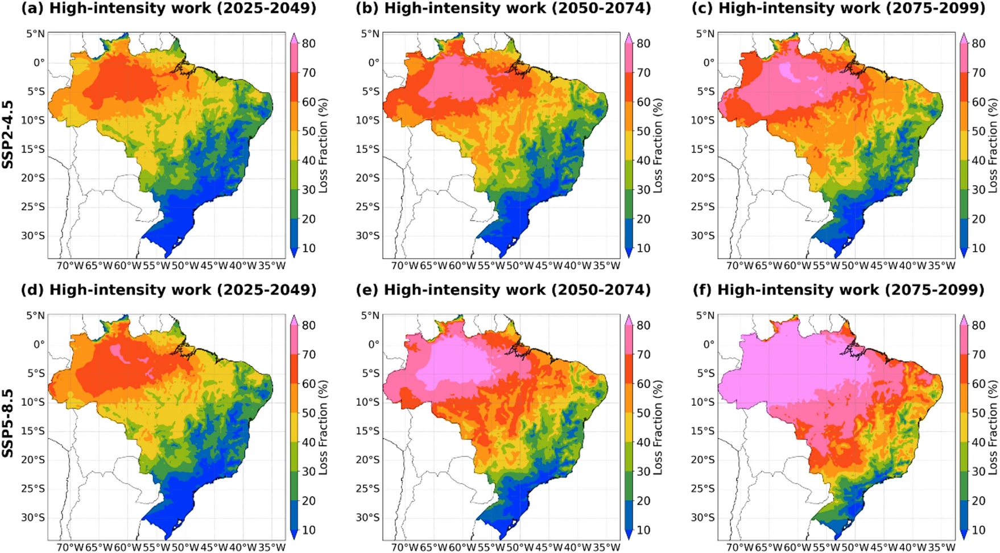

---
format:
  pdf:
    header-includes:
    - \renewcommand{\familydefault}{\sfdefault}
    geometry: "left=2.5cm,right=2.5cm,top=2.5cm,bottom=2.5cm"
    fontfamily: helvet
pdf-engine: pdflatex
---

## Color assessment tasks

Discuss the following published figures. Consider in particular the following questions:

- Which aspects work well?
- Which aspects might be problematic (at least for some viewers)?
- How could the figure be improved?

_Hint:_ As a first assessment of the color properties, upload the figures
into the _Deficiency Emulator_ on [`https://hclwizard.org/`](https://hclwizard.org/).

\newpage

# Changing temperature in California

{width=100%}

\bigskip

**Source:** Figure 1 from Loarie SR _et al._ (2009). "The Velocity of Climate Change." _Nature_ **462**, 1052-1055. [`doi:10.1038/nature08649`](https://doi.org/10.1038/nature08649)


\newpage

# Velocity of temperature change by biome

{width=98%}

\bigskip

**Source:** Figure 3 from Loarie SR _et al._ (2009). "The Velocity of Climate Change." _Nature_ **462**, 1052-1055. [`doi:10.1038/nature08649`](https://doi.org/10.1038/nature08649)


\newpage

# Loss of productivity in high-intensity work in Brazil

{width=100%}

\bigskip

**Source:** Figure 3 from Dantas LG _et al._ (2025). "Projected Productivity Losses and Economic Costs due to Heat Stress under Climate Change Scenarios in Brazil." _Scientific Reports_ **15**, 39775. [`doi:10.1038/s41598-025-23487-w`](https://doi.org/10.1038/s41598-025-23487-w)


\newpage

# UWZ severe weather warnings for Austria, 2026-03-26

```{r uwz}
#| fig-height: 6
#| fig-width: 8
#| out-width: 100%
#| echo: false
#| message: false
library("sf")
library("ggplot2")
AT   <- read_sf("data/UWZ_AT.geojson")
WARN <- read_sf("data/UWZ_warnings_2026-03-26.geojson")

cols <- c("#00ff39", "#ffff40", "#ffb430", "#ff001b", "#ff0cfa") |> setNames((-1):3)
labs <- c("Keine Warnungen", "Vorwarnung", "Unwetter", "Starkes Unwetter", "Sehr starkes Unwetter") |> setNames(names(cols))
ggplot() +
    geom_sf(aes(fill = as.factor(-1)), data = AT, col = NA) +
    geom_sf(aes(fill = as.factor(level)), data = WARN, col = NA) +
    geom_sf(data = AT, fill = NA, lwd = .2) +
    scale_fill_manual(values = cols, name = "", labels = labs) +
    theme_minimal() +
    theme(legend.position = "bottom", legend.direction = "horizontal")
```

\bigskip

**Source:** Österreichische Unwetterzentrale, 2026-03-26. [`https://www.uwz.at/`](https://www.uwz.at/)


**Translations:**

- Keine Warnungen (no warnings)
- Vorwarnung (pre-warning)
- Unwetter (meteorological disturbance)
- Starkes Unwetter (severe weather)
- Sehr starkes Unwetter (very severe weather)


